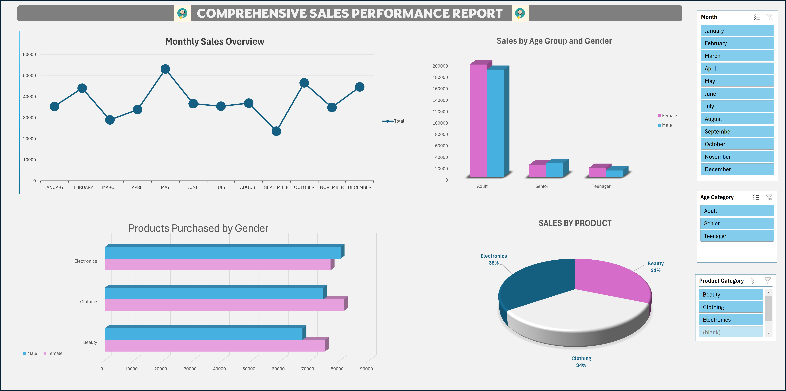
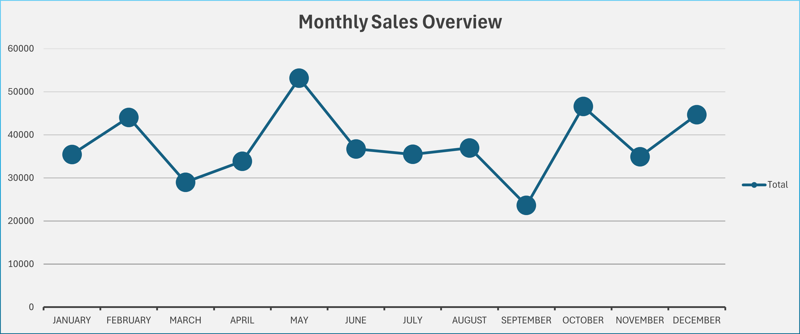
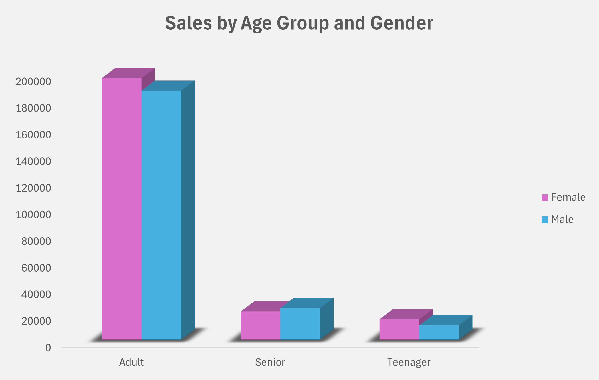
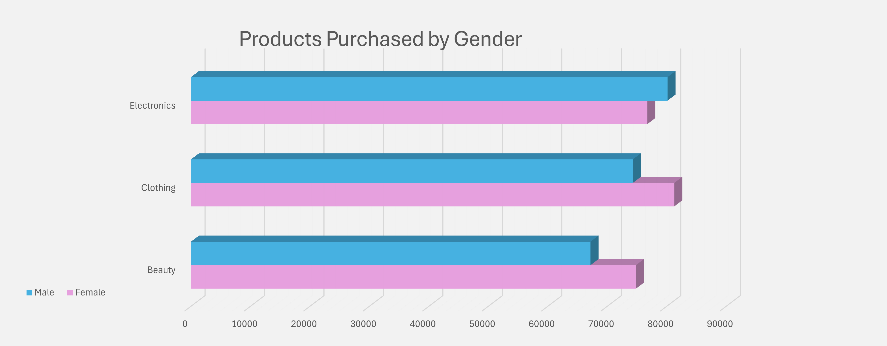
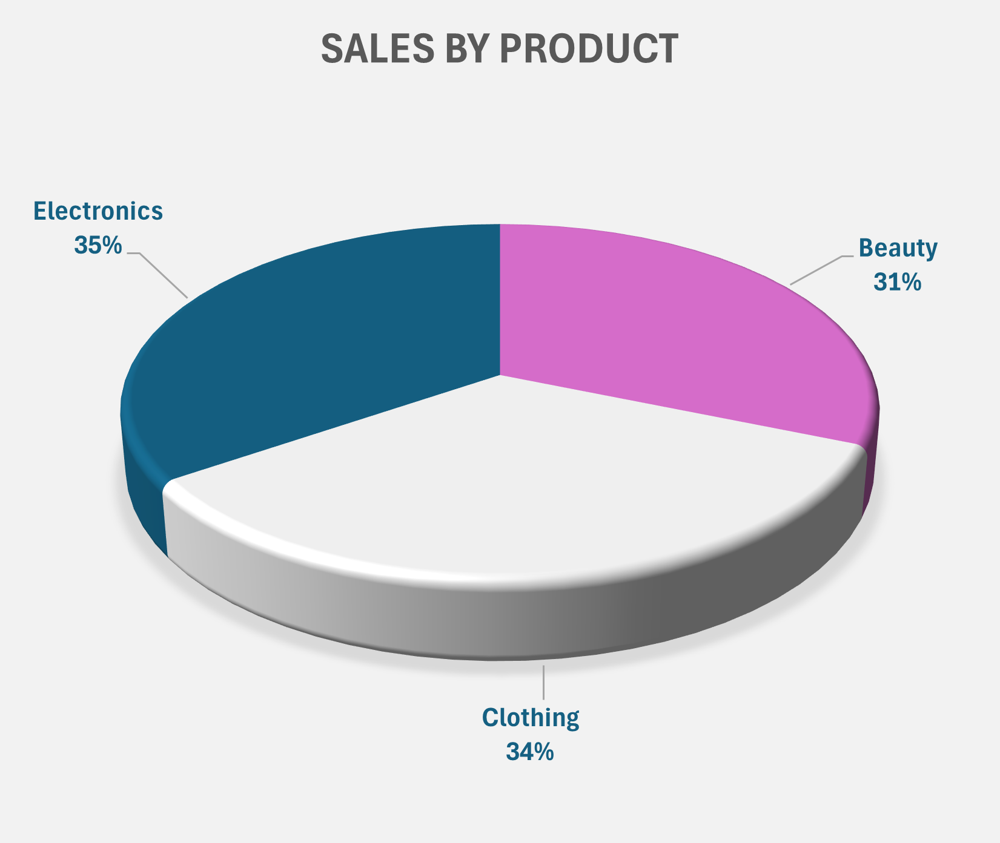

# Introduction
### This analysis provides a comprehensive overview of retail sales performance using the given dataset. The data captures aggregated sales amounts across different categories, which allows exploration of trends and patterns.

# The tools I Used
### PivotTables and PivotCharts in Microsoft Excel

# The Visualization and Analysis

## Overview
### I summarized the data I needed using PivotTables, and then I used PivotCharts to further illustrate it. In order to filter the data, I also provided slicers.
#### Here’s an overview of the sales data:

## Monthly Sales Comparison

### 📊 Sales Insights

- **May** recorded the highest sales, marking the yearly peak.  
- **September** had the lowest sales, representing the weakest month.  
- Sales dipped in **March**, peaked in, and declined again in late summer.  
- Recovery appeared in the final months, with **October and **December** performing strongly.  
- Overall, sales showed a **fluctuating pattern** with two peaks (May, October) and two dips (March, September).

## Sales by Age Group & Gender

### 👥 Comparison between Age and Gender
- **Adults** dominate sales, making them the primary customer group.  
- Within Adults, **Females slightly outperformed Males**.  
- **Seniors** contributed moderately, with Males leading slightly.  
- **Teenagers** generated the least sales, with Females ahead.  
- Overall, **Adults drive the majority of revenue**, while Seniors and Teenagers represent smaller but steady segments.

## Products Purchased by Gender

### 🛒 Comparison between Product Categories
- **Electronics** purchases are strong for both genders, with Males slightly ahead.  
- **Clothing** is the most purchased category overall, with Females leading.  
- **Beauty** shows the largest gender gap, with Females clearly ahead of Males.  
- Overall, **Clothing and Beauty drive the highest purchases**, while Electronics remains consistently popular across genders.

## Sales by Product

### 📊 Insights
- **Electronics** slightly leads as the top-performing category, holding the largest share.  
- **Clothing** follows closely behind, almost matching Electronics with a competitive share.  
- **Beauty** records the lowest portion among the three, but still maintains a strong contribution.  
- Overall, sales are fairly balanced across all categories, with no single product line overwhelmingly dominating.

## 🔍 Reconciling the Two Charts

- In the gender breakdown, **Females drive higher purchases in Clothing and Beauty**, while **Males slightly lead in Electronics**.  
- This makes **Clothing appear as the top choice by gender** when categories are viewed separately.  
- However, when combining both genders, **Electronics still holds the largest overall sales share**, driven by its higher value per transaction.  
- In short: **Clothing leads in purchase frequency, but Electronics leads in total sales value**.  

